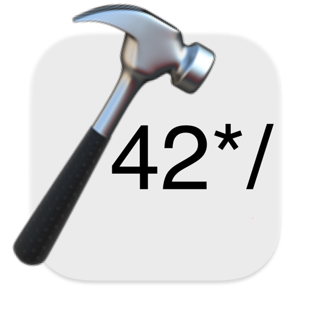

    

# School 42 Header

**School 42 Header** is an Xcode Source Editor extension that makes it easy to insert or update damn school 42 header.

## Installation

- Download latest *School42Header* package from the [Releases](https://github.com/DimaRU/School42Header/releases).
- Copy *School42Header* to your *Applications* folder.
- Launch *School42Header* once. You can close it immediately afterwards.
- Go to <kbd>System Preferences</kbd> > <kbd>Extensions</kbd> > <kbd>Xcode Source Editor</kbd> > select <kbd>Header 42</kbd>

## Setting Hotkey in Xcode

- Open Xcode
- Go to Xcode > Preferences > Key Bindings
- Type *'Header 42'* in search field
- Assign <kbd>⌃</kbd> + <kbd>⌘</kbd> + <kbd>⎇</kbd> + <kbd>H</kbd> to *Insert/update* command

## Feedback

Pull requests, issues and suggestions are welcome.

Feel free to contact me [@DimaRURU on Telegram](https://t.me/DimaRURU).
